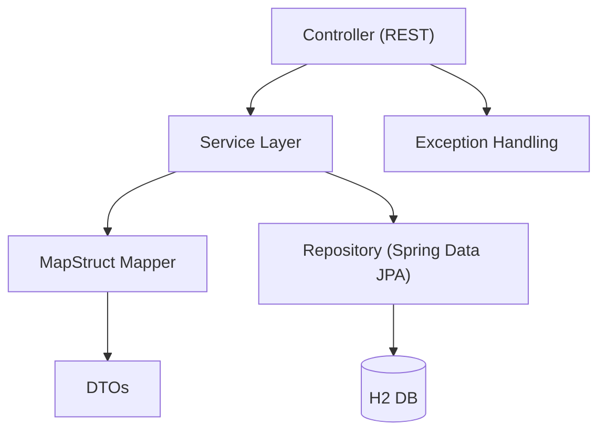

# 📚 Seminarverwaltung

Ein Spring Boot 3.4.4 Projekt zur Verwaltung von Seminaren mit H2-Datenbank, Springdoc OpenAPI (Swagger UI), MapStruct und Spring Validation.  
Dieses Projekt wurde als **praxisnahes Schulungsbeispiel** konzipiert, um moderne Spring-Technologien, Testmethoden und Softwarearchitektur in einem realistischen Szenario zu demonstrieren.

---

## 🔗 Wichtige URLs

### 🧪 Swagger UI (API-Dokumentation)

Die interaktive OpenAPI-Dokumentation ist unter folgender URL erreichbar:

👉 [http://localhost:8080/swagger-ui/index.html](http://localhost:8080/swagger-ui/index.html)  
👉 [http://localhost:8080/v3/api-docs](http://localhost:8080/v3/api-docs)

---

### 💾 H2-Konsole (In-Memory-Datenbank)

Zum Zugriff auf die eingebettete H2-Datenbank während der Entwicklung:

👉 [http://localhost:8080/h2-console](http://localhost:8080/h2-console)

**Standard Login-Daten:**

- **JDBC URL:** `jdbc:h2:./seminare;AUTO_SERVER=true`
- **Benutzer:** *(leer lassen)*  
- **Passwort:** *(leer lassen)*

---

## ⚙️ Voraussetzungen

- Java 17
- Maven
- IDE deiner Wahl (z.B. IntelliJ IDEA, VSCode oder Eclipse)

---

## 🧰 Verwendete Technologien

- **Spring Boot 3.4.4**
- **Spring Web, Spring Data JPA, Spring Validation**
- **Springdoc OpenAPI 2.8.6**
- **H2 In-Memory-Datenbank**
- **MapStruct 1.6.3**
- **Lombok**

---

## 🚀 Projekt starten

```bash
./mvnw spring-boot:run
```

oder (bei installiertem Maven):

```bash
mvn spring-boot:run
```

---

## 📁 Projektstruktur (Auszug)

```
src/
 └─ main/
     ├─ java/
     │   └─ gmbh.conteco.seminarverwaltung
     │       ├─ controller/
     │       ├─ domain/
     │       ├─ dto/
     │       ├─ mapper/
     │       ├─ repository/
     │       └─ service/
     └─ resources/
         └─ application.properties
```

---

## 🧩 Wichtige Maven-Abhängigkeiten (Auszug)

```xml
<dependency>
    <groupId>org.springdoc</groupId>
    <artifactId>springdoc-openapi-starter-webmvc-ui</artifactId>
    <version>2.8.6</version>
</dependency>

<dependency>
    <groupId>com.h2database</groupId>
    <artifactId>h2</artifactId>
    <scope>runtime</scope>
</dependency>
```

---

## 🧠 Architekturübersicht




Diese Schichtenarchitektur trennt Verantwortlichkeiten klar und ermöglicht Testbarkeit, Wartbarkeit und Erweiterbarkeit.

---

## ✅ Hinweise

- Die **H2-Konsole** und **Swagger UI** sollten **nicht in der Produktion aktiviert** sein.
- Die API-Dokumentation wird automatisch aus allen mit `@RestController` annotierten Klassen generiert.
- **MapStruct** benötigt die `mapstruct-processor`-Abhängigkeit und ist in der `maven-compiler-plugin`-Konfiguration eingebunden.

---

## 🛠 Entwickler-Setup

Nutze IntelliJ oder eine andere IDE wie VSCode oder Eclipse mit Unterstützung für Lombok und Annotation Processors. Stelle sicher, dass `annotation processing` in den Einstellungen aktiviert ist.

---

## 🧪 Testen

Die Anwendung enthält sowohl **Unit-Tests**, **Integrationstests** als auch **Web-MVC-Tests**.

### Testarten und Schulungszweck

| Testtyp          | Gezeigte Inhalte                                                                 |
|------------------|----------------------------------------------------------------------------------|
| Unit-Tests       | Getestet werden z. B. Mapper (`SeminarMapperTest`)                              |
| Integrationstests| Speicherung, Abfragen und Beziehungsketten (`SeminarRepositoryIntegrationTest`) |
| Web-MVC-Tests    | REST-API-Tests mit `MockMvc` (validierung, Fehlerfälle, Erfolgsfälle)            |
| End-to-End Tests | Kombiniert mit `@SpringBootTest` und echter Datenbank (`testcontainers` optional)|

### Beispielbefehl

```bash
mvn test
```

---

## 🧠 Schulungsrelevante Features

Dieses Projekt demonstriert wichtige Best Practices aus dem Spring-Ökosystem:

### Spring-Features

- 🧭 REST-API mit Spring Web und `@RestController`
- 🎯 Validierung mit `jakarta.validation` + `@Valid`
- 🔁 DTO-Mapping mit **MapStruct**
- 📝 Automatische API-Dokumentation mit **springdoc-openapi**
- 🧑‍🏫 Rollenbasierte Zuordnung (Dozent, Kunde)
- 🧩 Enum-Mapping (SeminarStatus, SeminarArt)
- 🗃 H2-Datenbank für Entwicklung & Tests
- 💥 Exception Handling mit `@RestControllerAdvice`

### Testing-Features

- 🧪 Unit-Tests für Mapper & Logik
- 🧪 Integrationstests mit echten Repositories (inkl. SQL-Setup & -Cleanup)
- 🧪 WebMvc-Tests mit `MockMvc` zur API-Validierung
- 🧪 Fehlerfall-Tests mit strukturierter Fehlerausgabe

---

## 🔄 CI/CD (optional)

### 📦 Maven Build

```bash
mvn clean verify
```

### 🧪 GitHub Actions (Beispiel Workflow)

```yaml
name: Java CI

on: [push, pull_request]

jobs:
  build:
    runs-on: ubuntu-latest
    steps:
      - uses: actions/checkout@v4
      - name: Set up JDK 17
        uses: actions/setup-java@v4
        with:
          java-version: '17'
          distribution: 'temurin'
      - name: Build with Maven
        run: mvn clean verify
```

---

## 📬 Fragen oder Feedback?

Erstelle ein Issue oder kontaktiere das Team von **CONTECO e.U.**